

  

    

    
 <!-- INTRO -->     
      

        <header class="post-header">
          <h1 class="post-title text-center">The SuperNEMO experiment</h1>
          </header>
              
The SuperNEMO Demonstrator patricle detector is currently running at the LSM in France.

              
              
Use the buttons on the right to find out more about $\beta\beta$ decay, the rare process we are investigating; NEMO's unique tracker-calorimeter design; how SuperNEMO is demonstrating new technologies that could unlock the mystery of $\beta\beta$ decay mechanisms; and the Demonstrator's physics goals.

              
Alternatively, why not watch the videos below, made by our current and former students, to get an introduction to SuperNEMO? Don't forget to like and subscribe to our <a href="https://www.youtube.com/@SuperNEMOExperiment" target="_blank">YouTube</a> channel!
             

              

  <!-- Big player -->
  

    <iframe
      id="player"
      title="YouTube video player"
      loading="lazy"
      allow="autoplay; encrypted-media; picture-in-picture; web-share"
      allowfullscreen
    ></iframe>
  

  <!-- Thumbnails -->
  <ul class="thumbs" aria-label="Video list">
    <li>
      <button class="thumb" data-video-id="n1_cp28B8IY" aria-label="Play: Source Foils">
        
      </button>
    </li>
    <li>
      <button class="thumb" data-video-id="tqgiYncqB4w" aria-label="Play: Tracker">
        
      </button>
    </li>
    <!-- Add more thumbnails as needed -->
  </ul>

       

<!-- BB DECAY -->
      

      <header class="post-header">
      <h1 class="post-title text-center"> $\beta\beta$ decay: the physics of SuperNEMO</h1>
    </header>

  

    <h4> About neutrinos</h4>
    
Neutrinos, the light, uncharged cousins of electrons, are the second-most abundant particles in the universe, with millions of them streaming through your body every minute. But even though they are everywhere, they are some of the least understood particles that we know about. Neutrinos have no electric charge, and until recently, we thought they had no mass, as predicted by the Standard Model of particle physics. Now we know that they do have mass - though they are very light -  but we don't know how. Thanks to experiments looking at a phenomenon called neutrino oscillations, we are starting to learn more about them, but there is still a lot we don't know. What are their absolute masses? How did they get them? And as they are electrically neutral - could they be their own antiparticles? By looking for an extremely rare process called neutrinoless double beta decay, SuperNEMO hopes to answer some of those questions.

  

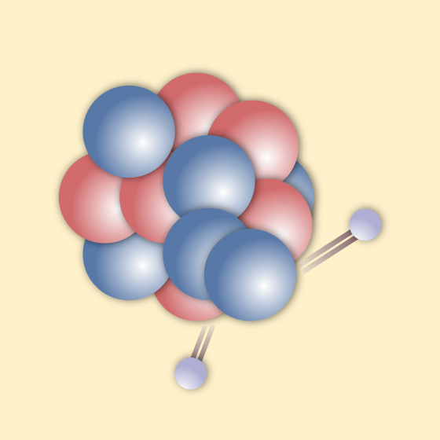

<h4> Beta decay - two different kinds</h4>

  
There are many radioactive isotopes, with neutron-rich nuclei, that undergo beta decay. When this happens, a neutron in the nucleus decays to a proton, ejecting an electron ($\beta$ particle) and an electron-antineutrino. The resulting nucleus is more stable (has a lower energy). This 'lost' energy , $Q_\beta$, is shared between the electron and the neutrino.

  
For a handful of isotopes, the nucleus resulting from a single decaying neutron would not be more stable, meaning $\beta$ decay is forbidden. However, if <em>two</em> neutrons decay at <em>the same time</em>, we do get a lower-energy nucleus, with an energy difference we call $Q_{\beta\beta}$. This decay is very rare, with a half-life longer than the age of the universe. It has been observed for 12 nuclei, by experiments including our predecessor NEMO-3. As it produces two beta electrons and 2 (electron-anti)neutrinos, we call it $2\nu\beta\beta$, a 2-neutrino double beta decay.

  

    <h4>Neutrinoless double beta decay</h4>
    
This raises another possibility - what if neutrinos are their own antiparticles? (As with other electrically neutral particles, like the photon). In that case, in a $\beta\beta$ decay, the two antineutrinos could effectively annihilate, meaning our interaction produces only the two $\beta$ electrons, which carry the whole reaction energy $Q_{\beta\beta}$. This process is called neutrinoless double beta decay ($0\nu\beta\beta$), and so far, it has never been observed. SuperNEMO is trying to change that.

    
If we see a $0\nu\beta\beta$ decay, that has big implications for physics. In 1937, Ettore Majorana proposed a mechanism whereby neutrinos are their own antiparticles - known as Majorana neutrinos. Observing a $0\nu\beta\beta$ decay would prove that the theory was true, explaining how neutrinos get their mass, and giving us clues as to how we live in a universe made only of matter, and not antimatter.

  

  

    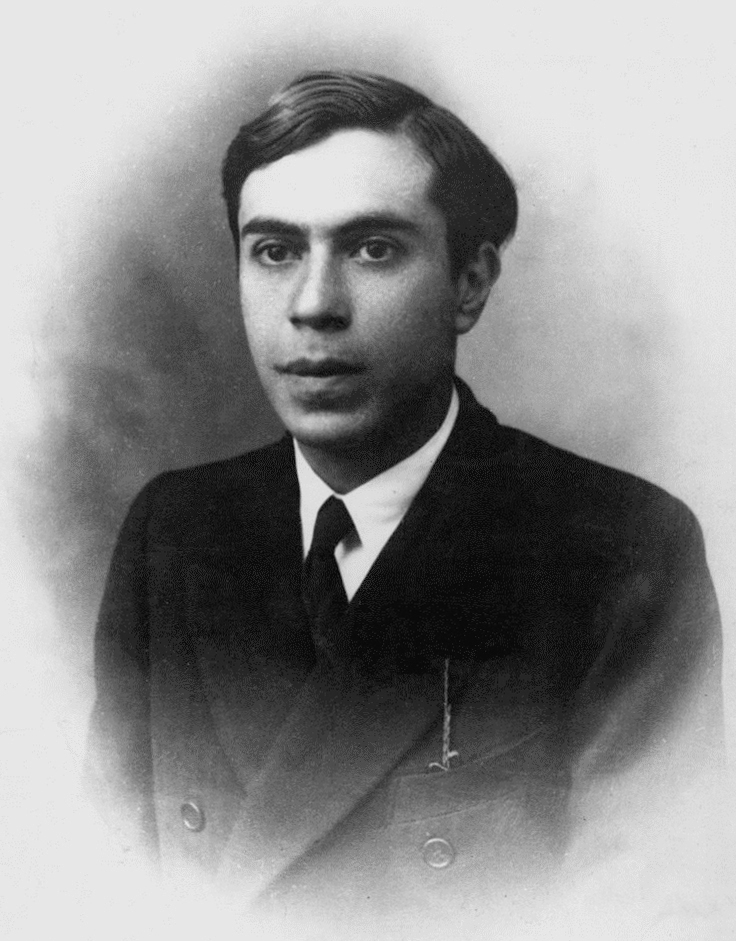
  

  

    <h4> How does $0\nu\beta\beta$ work?</h4>
    
The answer - we don't know! The classic way to tell whether a double-beta decay process was neutrinoless is to measure the total energy of the two electrons produced; if it's equal to $Q_{\beta\beta}$, that tells us that nothing but the electrons were created. In fact, that's how most $0\nu\beta\beta$ search experiments work - they are able to measure total energy with a very high precision, giving them a great sensitivity to separate the $0\nu\beta\beta$ and $2\nu\beta\beta$ processes.

    
While this technique is a great way to search for $0\nu\beta\beta$, the problem is that it doesn't tell us any extra information - it's perfect for finding out <i>that</i>  $0\nu\beta\beta$  has happened, but not <i>how</i> it happened. In fact, there are several different theories that predict $0\nu\beta\beta$  decay, and a measurement of total energy isn't enough to tell them apart. Instead, you need to look in more detail at the two individual electrons - how the decay energy is distributed between them, and at their relative angle of emission. That's where SuperNEMO comes in! With its full topological reconstruction, SuperNEMO has access to this information. In fact, the <a href="https://arxiv.org/pdf/1910.04688">2019 APPEC report</a> said that:

    <blockquote>The SuperNEMO tracker-calorimeter approach remains the best way to explore a signal above 50 meV with multiple isotopes combined with a full topological reconstruction of the final state events, and further R&D may be able to push this further into the inverted ordering region.</blockquote>
  

<!-- NEMO TECHNIQUE -->

    <header class="post-header">
      <h1 class="post-title text-center"> The NEMO technique</h1>
    </header>
    

      
      

      
Mouse over the diagram below to learn about the three elements that give the NEMO tracker-calorimeter technique its unique ability to study $\beta\beta$ decays in more detail than other detector designs!

      

    

    

      

            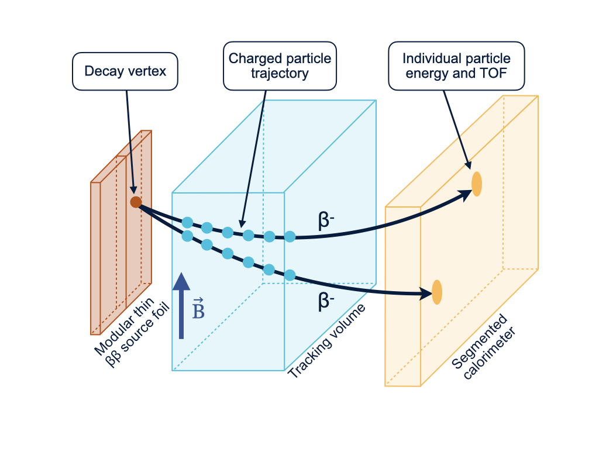
        <map name="techniquemap">
          
                  
          
                
          
          
          </map>
                

    

    
         

                 

                                <h2>Source foil</h2>
        

        
   
                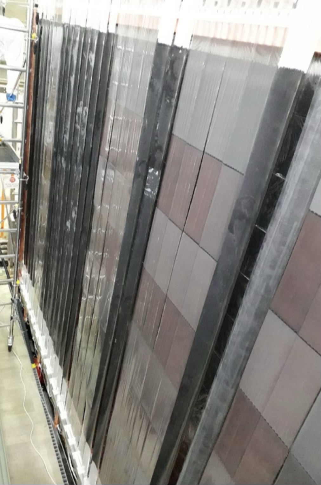
        

      

                
          

                    The $\beta\beta$ source consists of thin foils of a $\beta\beta$ candidate isotope. The decay source is completely decoupled from the tracker and calorimeter, meaning it can be made from any solid isotope. This could be invaluable in the case of a $0\nu\beta\beta$ discovery; if the decay is seen in one isotope, we will need to search for it in others, to test whether they follow theorists' predictions.
          

      
   

    
   
    
    

        

                <h2>Tracking detector</h2>
        

        

          
The tracker is SuperNEMO's most powerful tool for identifying individual particles. An array of Geiger cells, combined with sophisticated reconstruction software, allow us to build a 3-dimensional picture of the paths of charged particles through the detector. By applying a magnetic field, we will also be able to determine whether they are positively or negatively charged. This enables powerful background rejection, by allowing us to select only decays with the 'golden' $\beta\beta$ signature of two electron-like tracks originating from a common point on the source foils. It also enables us to determine the angle between the electrons' trajectories, which can help us understand $\beta\beta$ decay mechanisms - for example whether they occurred via left- or right-handed weak currents.
          

      
    
       
   
                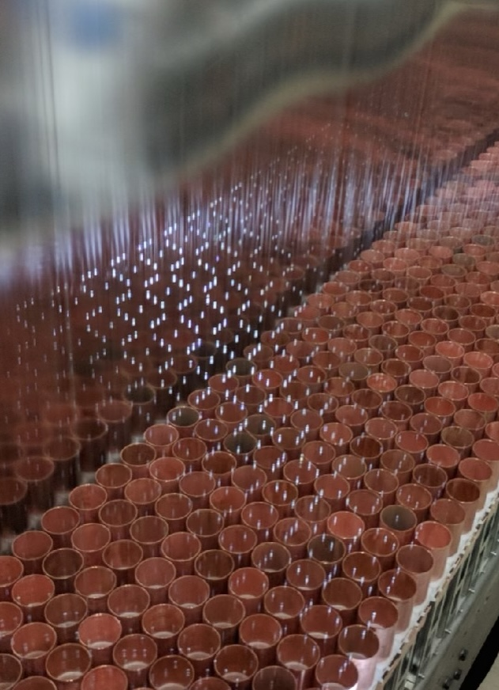
            
  
    

    

                      

                <h2>Segmented calorimeter</h2>
                

                      

                
The decay energy (typically in the few-MeV scale) is the characteristic signature that distinguishes the new physics of neutrinoless double-beta decay, $0\nu\beta\beta$ from the Standard-Model process  $2\nu\beta\beta$. With the NEMO technique, we can measure the individual energies of each electron. This can allow us to investigate nuclear effects on  $2\nu\beta\beta$ processes, such as the effect of $g_A$ quenching and, combined with topological information from the tracker, can help us search for exotic $\beta\beta$ decay modes. The calorimeter also lets us detect and measure the energy of gamma rays, which are not seen by the tracker. This helps us reject backgrounds, and investigate phenomena like $\beta\beta$ decays to excited nuclear states. The calorimeter's excellent timing resolution also provides a powerful background rejection tool, helping us distinguish between particles crossing the detector, and pairs of particles emitted from the source foil.
          

      
  
             
   
                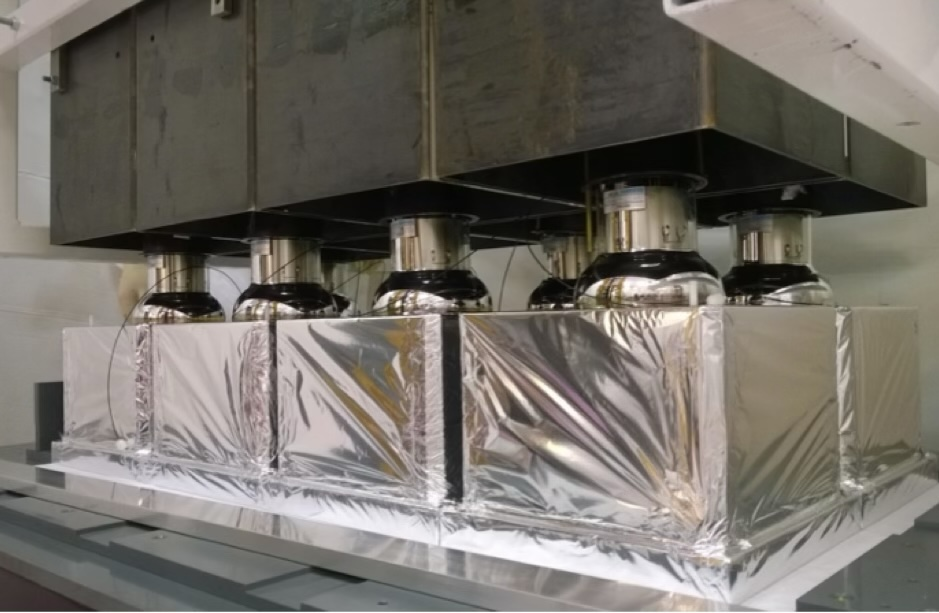
            
      
    

    

<!-- TECH DEMONSTRATOR -->

    <header class="post-header">
      <h1 class="post-title text-center"> SuperNEMO: Technology Demonstrator</h1>
    </header>
  

    

      
The SuperNEMO Demonstrator Module is now taking physics data at the <a href="https://lpsc.in2p3.fr/?page_id=547">Laboratoire Souterrain de Modane</a>, in the Fréjus tunnel in the French Alps. It acts as a proof of concept of our detector design, which can be expanded in future to a larger, modular detector. In the event of $0\nu\beta\beta$ discovery, a large SuperNEMO-style detector will be key to understanding the $0\nu\beta\beta$ decay mechanism.
      

      
 Click on the images below to learn more about the different technologies being validated with the SuperNEMO Demonstrator.

      
  
      
    

    

          

               <a id="img-source" class="img-wrap" href="#">
                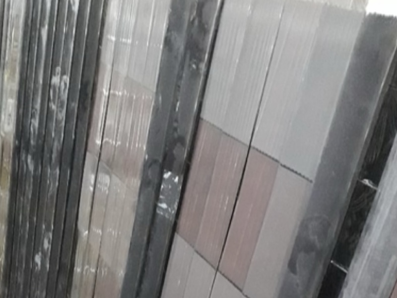 
                
$\beta\beta$ source production

                </a>
          
 
          

            <a class="img-wrap" href="#">
                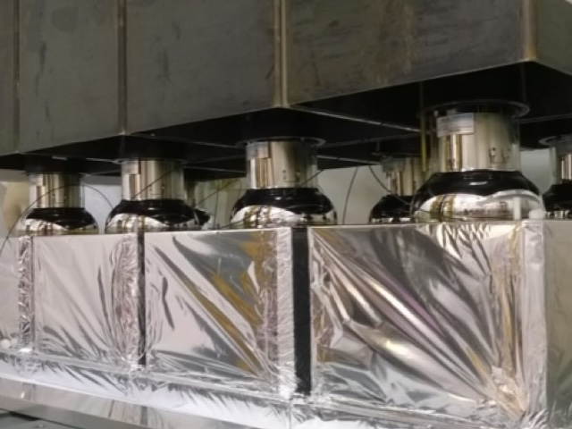
                
Calorimeter performance

            </a>
          
 

             <a class="img-wrap" href="#">
                
                
Tracker operation

              </a>
          

              

    
  
              

    
 
          

            <a class="img-wrap" href="#">
                
                
Helium recycling

            </a>
          
 
          

             <a class="img-wrap" href="#">
                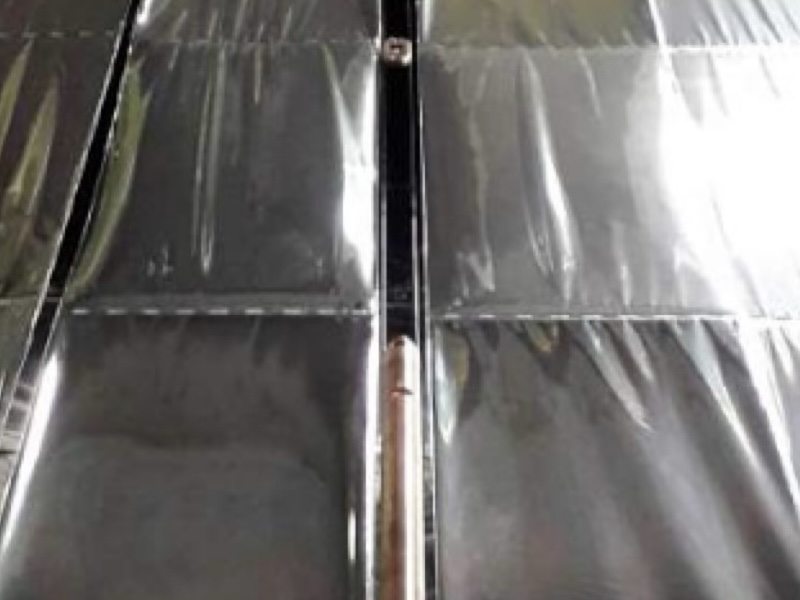
                
Automated calibration

            </a>
          
 
          

            <a class="img-wrap" href="#">
                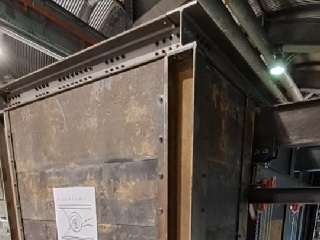
                
Background reduction

            </a>
      

  

<!-- NOT USED ANY MORE -->

    <header class="post-header">
      <h1 class="post-title text-center"> The SuperNEMO detector</h1>
    </header>

  

    

      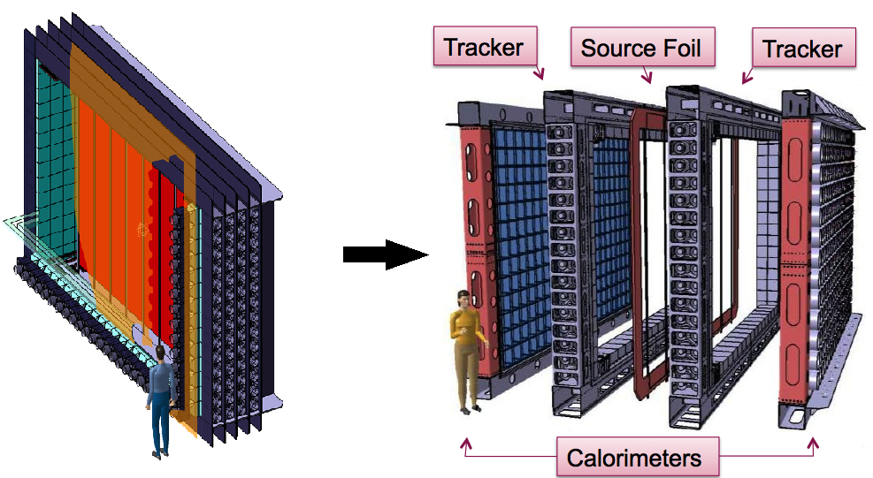
        <map name="detectormap">
          
          
          
          
          
          
          
          
          
          

      </map>
    

    

      
The SuperNEMO Demonstrator Module is located at the Laboratoire Souterrain de Modane, in the Fréjus tunnel in the French Alps. It acts as a proof of concept of our detector design, which can be expanded in future to a larger, modular detector.
      

      
 The Demonstrator Module has a tracker-calorimeter architecture, with a thin layer of $\beta\beta$-emitting isotope sandwiched between trackers and surrounded by calorimetry. This allows for a full three-dimensional reconstruction of charged particle tracks, as well as energy measurements. Click on the detector components in the diagram to learn more about each part of the detector.
      

    

  

<!-- NEMO-3 -->

<header class="post-header">
<h1 class="post-title text-center"> NEMO-3 detector</h1>
</header>

  

    

      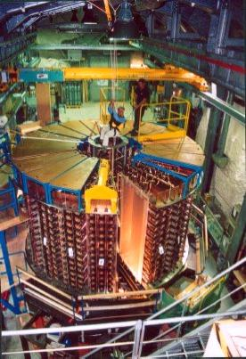
    

    

      
The NEMO-3 detector was the previous occupant of SuperNEMO's location in the LSM underground lab near Modane, France. Like SuperNEMO, NEMO-3 studied double-beta decay. It ran from January 14th, 2003 to January 11th, 2011. However, the NEMO collaboration had been working on this physics since 1989, starting with the NEMO-1 and NEMO-2 prototype detectors.

      
NEMO-3 had a similar tracker-calorimeter structure to SuperNEMO, but was cylindrical, with a hole running through the middle. The outside of the cylinder, as well as the central hole, was lined with calorimeter blocks similar to those used on SuperNEMO. Source foils were located in between, forming a cylinder of foils, with wire tracker cells filling the area between the source and the inner and outer calorimeter walls.
      

      

      The photo shows the detector almost closed, before the assembling of the 20th sector. Later, the gamma/neutron proof device was assembled around the detector (a shield made of iron plates, wood panels and tanks full of borated water), with an anti-radon tent enclosing the full setup.
      

    

  

   
  

    
    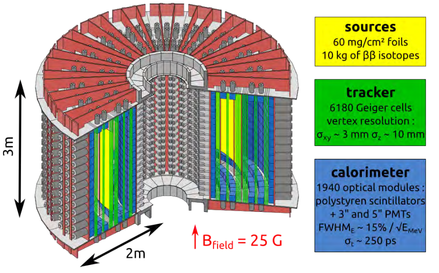
      
    

  

   
  

    

      
This picture shows a neutrinoless double beta decay candidate event in the NEMO3 detector (top view). From the Geiger signal extracted from the drift cells along the charged particles trajectory (small coloured circles), one can here reconstruct the tracks of two charged particles: the curvatures in the magnetic field are compatible with electrons coming from the source foil (vertex) made of enriched molybdenum. The total energy deposit in the two hit scintillator blocks is 2875 keV which is expected for a neutrinoless double beta decaying $^{100}$Mo nucleus ( $Q_{\beta\beta}= 3\;\mathrm{MeV}$ ) corrected by energy loss in the source foil, the gas of the tracking chamber and convoluted by the calorimeter energy resolution.
      

    

    

      
    

  

   
  

    

      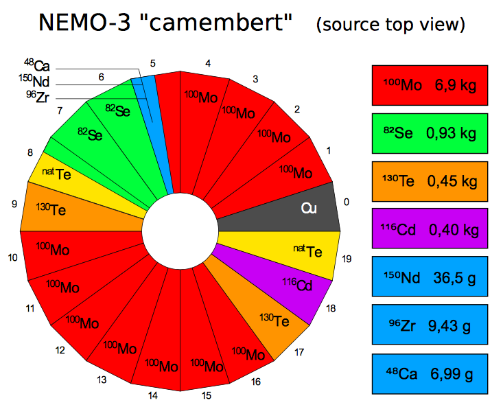
        
        

    

      
 The NEMO-3 detector was divided into 20 sectors. Different sectors contained source foils of different $\beta\beta$ isotopes, allowing NEMO-3 to study decays in several different materials at the same time. This has enabled the NEMO-3 collaboration to produce an extensive set of analyses, which are still being worked on and published many years after the detector stopped taking data. As the diagram shows, the main isotope studied was molybdenum-100.
      

        

  

<!-- PHYSICS GOALS -->

    <header class="post-header">
      <h1 class="post-title text-center"> SuperNEMO Demonstrator physics</h1>
    </header>
    

        

            
SuperNEMO's tracker-calorimeter technology allows full topological event reconstruction, meaning that it can search for a wide range of exotic decays, as well as making precision studies of the $2\nu\beta\beta$ process. A SuperNEMO-style detector will be a vital tool in understanding the $0\nu\beta\beta$ mechanism in the event of a discovery, and a key role of the Demonstrator module is to test the technologies to enable that. However, the Demonstrator itself can also access plenty of exciting physics in just a few years of runtime. Click on the buttons below to learn more about what we can study with the current SuperNEMO detector.

        

    

    

        

        <!-- Tab links -->
            

              <button class="tablinks" onclick="physicsDetails(event, 'neutrinoless')">$0\nu\beta\beta$ decay mechanisms</button>
              <button class="tablinks" onclick="physicsDetails(event, 'nuclear')">Nuclear physics through $\beta\beta$ decay</button>
              <button class="tablinks" onclick="physicsDetails(event, 'exotic2nu')">Exotic modes of $2\nu\beta\beta$ </button>
            

        

    

    

            <!-- Tab content -->
            

              <h1>$0\nu\beta\beta$ decay mechanisms</h1>
              
An observation of $0\nu\beta\beta$ decay can only occur if a neutrino is a Majorana particle. However, there are several possible mechanisms - all requiring a Majorana neutrino - by which the decay could occur. These manifest in the topology of the decay, which SuperNEMO is uniquely placed to investigate.

            <h1>Left- or right-handed currents?</h1>
            
The characteristic signature of a neutrinoless $\beta\beta$ decay is one in which the two electrons carry all of the decay energy, $Q_\beta\beta$. Most predictions assume that this takes place through a light-neutrino exchange, via a Standard-Model weak current (V-A process). However, it is possible that some or all decays could instead involve a right-handed weak current (V+A). To preserve conservation laws of physics, these different mechanisms affect the probablity distributions of the angle between the electrons, and how the decay energy is shared between them

            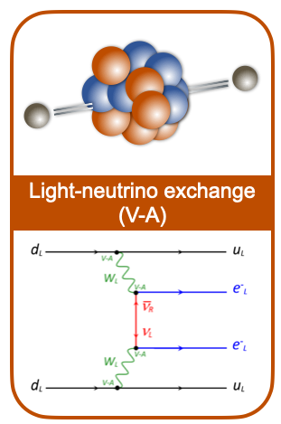
            

            

              <h1>Nuclear physics through $\beta\beta$ decay</h1>
              
xxx

            

            

              <h1>Exotic modes of $2\nu\beta\beta$ </h1>
              
xxx

            

    

<!-- Outdated physics goals part -->

    <header class="post-header">
      <h1 class="post-title text-center"> Physics goals</h1>
    </header>

  

      

          <h4> An ultra-low background experiment</h4>
          
Neutrinoless double-beta decay (if it exists at all) is an extremely rare process. Experiments, including our predecessor NEMO-3, have shown that it must have a half-life of more than $10^{24}$ years- over a trillion times the age of the universe. This means that, even with our best detectors, we will never see more than a tiny handful of $0\nu\beta\beta$ decays. This presents a big challenge - how to eliminate background events: other kinds of decays or interactions that mimic our signal. SuperNEMO is leading the way in ultra-low background technology through a double-pronged approach: an extremely radio-pure detector, and a unique tracking technique that enables us to identify background decays and remove them from our data sample.

      

  

  

    

      
      <h4> Radiopurity and the radon challenge</h4>
      
For an ultra-low-background experiment, we need to take extra care to ensure that even low-level radioactive substances are kept away from our detector. All of SuperNEMO's components are constructed from materials that have been carefully selected for their radiopurity. Scientists working on the detector wear special suits to prevent any contamination from their bodies and clothes.

      
With these precautions in place, our biggest radiopurity challenge comes from radon, a naturally-occurring radioactive gas whose decay chain can mimic the $\beta\beta$ signature. Potential detector components are tested for radon activity. Our requirements are so strict, we have to collect any radon produced by the components over a long period of time, and then concentrate it, in order for even a state-of-the-art radon detector to be able to measure its activity. In addition to this, SuperNEMO is contained within an anti-radon tent, which is flushed with purified gas. Using these techniques, we aim to have a radon activity less than 0.15 mBq/m$^3$, or approximately 1 decay every 10 minutes - a world-leading purity, 30 times better than our predecessor, NEMO-3.

      

  

  

    

    <h4> Particle identification</h4>
       
Many double-beta decay experiments are only able to measure the energy deposited when a decay happens. SuperNEMO's unique tracker-calorimeter design allows us to follow the passage of particles through the detector. By looking at the length and orientation of tracks, and using a magnetic field to help us determine the particle's charge, we are able to identify different types of particle as they move through the detector, allowing us to reject events that don't match our two-electron $\beta\beta$ decay signature. By using the timing and energy measurements from our calorimeter walls, we are able to distinguish $\beta\beta$-like decays, where two particles leave the source foil at the same time, from events where a particle passes into the detector from outside, scatters from the foil, and then leaves the detector. The calorimeters also help us identify events with the characteristic energy of a $0\nu\beta\beta$ decay, allowing us to reject our biggest background, $2\nu\beta\beta$ events, which deposit less energy. Using this combination of techniques, we have a unique ability to isolate true $0\nu\beta\beta$ events.

    

  

  

    

      <h4> The power of SuperNEMO</h4>
      
With this world-class background rejection, the SuperNEMO demonstrator should be well-place to identify the first $0\nu\beta\beta$ mankind has ever seen - or alternatively, to set a limit on the $0\nu\beta\beta$ half-life of 6.5$\times$10$^{24}$ years. A proposed full SuperNEMO, consisting of 20 modules, could increase this half-life sensitivity to 10$^{26}$ years.

      
In addition to this, the SuperNEMO technology is ideal for investigating $2\nu\beta\beta$ decays - not just in selenium-82 but in other isotopes, thanks to the modular technology which allows for the source foils to be swapped out. The detector could also be used for other kinds of new physics searches, such as looking for evidence of Lorentz violation.

    

  

    

<!-- FUNDING -->

  <header class="post-header">
    <h1 class="post-title text-center"> Funding support</h1>
  </header>
  

    

      
The NEMO collaboration would like to acknowledge the support of the following funding agencies: 

    

  

        
        
        

          
        

          

            

          <a href="{{ agency.url }}" target="_blank"> </a>
          

            

        

        

          <a href="{{agency.url}}" target="_blank">
            {{ agency.Agency }}
            </a>
        

        

        
        

  

    
    

<!-- Buttons down right hand bar -->
    

        

        

          

            

              Experiment intro
            

          

        

      
<!-- End of intro button -->
      

        

          

            

              $\beta\beta$ decay
            

          

        

      
 <!-- End of bb button -->
     

        

          

            

              The NEMO technique
            

          

        

      
 <!-- End of technique button -->
      

        

          

            

              SuperNEMO - technology demonstrator
            

          

        

      
 <!-- End of tech demo button -->

      

        

          

            

              SuperNEMO physics capabilities
            

          

        

      
 <!-- End of Physics button -->
      

        

          

            

              NEMO-3 detector
            

          

        

      
<!-- End of NEMO3 button -->
      

        

          

            

              Funding support
            

          

        

      
<!-- End of Funding button -->
     

  

<!-- Calorimeter Modal -->

  

    <!-- Modal content-->
    

      

        <button type="button" class="close" data-dismiss="modal">&times;</button>
        <h4 class="modal-title">Calorimeter wall</h4>
      

      

        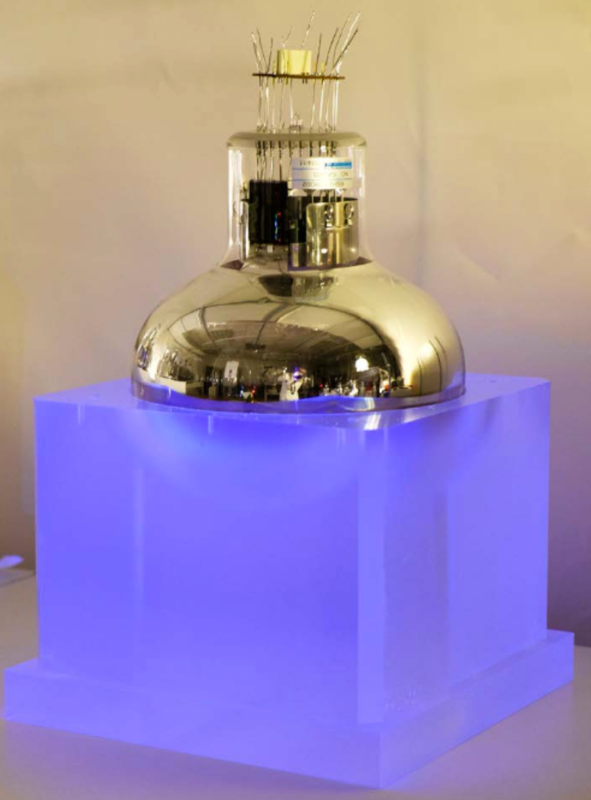
          
The calorimeter walls at the outside of the detector measure the energy of particles that reach the edge of the detector. The two main calorimeter walls consist of 520 optical modules. These are blocks of polystyrene scintillator coupled to 8” photomultiplier tubes and wrapped in teflon and mylar, with individual iron shielding. Optical modules positioned above, below and to the sides of the tracker, give a total of 712 modules, allowing SuperNEMO to measure particles' individual energies, whatever their direction of travel. Over 97% of the calorimeter is operational, giving excellent coverage.

          
          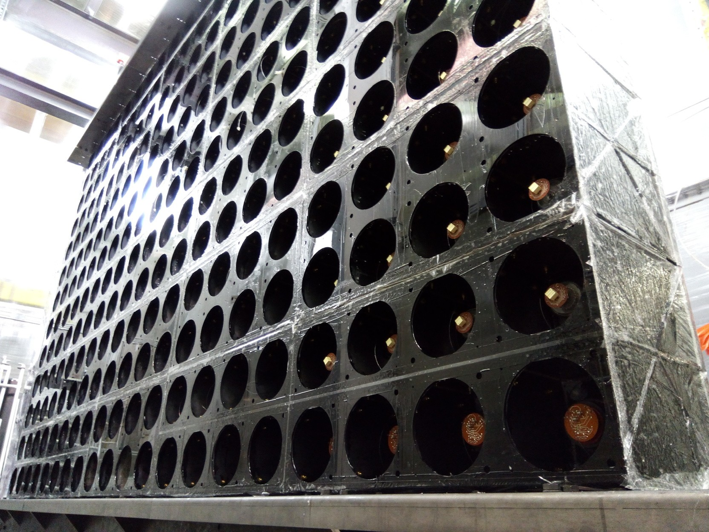
            
SuperNEMO's excellent time resolution - just 615 ps for $\gamma$ rays, with a target of 250ps for 1MeV electrons - allows us to separate $\beta\beta$-like events from externally-generated backgrounds, like electrons crossing the detector. Energy calibration is ongoing, with sophisticated nonlinearity corrections implemented to accurately reproduce detector effects. Our aim is for a resolution of 8% FWHM at 1MeV.

            

      

        <button type="button" class="btn btn-default" data-dismiss="modal">Close</button>
      
 <!-- modal-footer -->
    
<!-- modal-content -->
  
<!-- modal-dialog -->

<!-- modal -->

<!-- Source foil Modal -->

  

    <!-- Modal content-->
    

      

        <button type="button" class="close" data-dismiss="modal">&times;</button>
        <h4 class="modal-title">Source foil production</h4>
      

      

        
          
SuperNEMO's $\beta\beta$-decay <a href ="https://www.degruyterbrill.com/document/doi/10.1515/ract-2019-3129/html"  target="_blank">source</a> consists 34 0.3mm-thick foils enriched to 96-99% in $^{82}$Se, for a total of 6.11kg of isotope. $^{82}$Se was chosen for its high decay energy ($Q_{\beta\beta}$ = 3MeV), which is above the energy of the most common background processes. $^{82}$Se also has a long $2\nu\beta\beta$ halflife ($8.7\times10^{19}$ years), which helps minimise background in the $0\nu\beta\beta$ region of interest.
          

          
The SuperNEMO Demonstrator is a proof of concept for novel foil geometries and powder production techniques, as well as new purification processes, which aim to produce ultra-radiopure foils with activities below 2 $\mu$Bq/kg for $^{208}$Tl and 10 $\mu$Bq/kg for $^{214}$Bi.
          

          

      

        <button type="button" class="btn btn-default" data-dismiss="modal">Close</button>
      
 <!-- modal-footer -->
    
<!-- modal-content -->
  
<!-- modal-dialog -->

<!-- modal -->

<!-- Tracker Modal -->

  

    <!-- Modal content-->
    

      

        <button type="button" class="close" data-dismiss="modal">&times;</button>
        <h4 class="modal-title">Tracker operation</h4>
      

      

        
          
SuperNEMO's wire-chamber tracker enables our unique particle identification and full topological event reconstruction. SuperNEMO Demonstrator's two tracker chambers comprise almost 15,000 individual wires, each around 3 metres long, and used to form over 2,000 Geiger cells, each with its own indivudally-controllable high voltage system. The Demonstrator's tracker geometry is designed to be scalable, allowing the possibility of efficient scaling to larger future detectors. More than 98% of the tracker is fully operational.
          

            The tracker is filled with a carefully-controlled mixture of around 95% helium (low density), 4% ethanol (to quench the electron avalanche in the drift cells) and argon (for its low ionisation potential). When a charged particle passes through a drift cell, the time for the resulting electron shower to drift to the anode tells us the particle's distance from the centre of the cell. Pulses on the two cathode end caps enable us to calculate the particles height. In this way, we can reconstruct particles' tracks through the tracker in three dimensions. 
          

          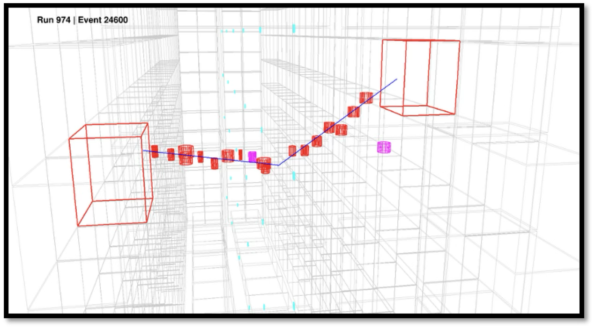
                    

            This is done through novel reconstruction algorithms which, when combined with timing information from the calorimeter, enable us to identify the "golden" signture of a $\beta\beta$ event, the distinctive signatures of background processes, and the characterstic topologies of beyond-the-Standard-Model decay mechanisms.

            
            

      

        <button type="button" class="btn btn-default" data-dismiss="modal">Close</button>
      
 <!-- modal-footer -->
    
<!-- modal-content -->
  
<!-- modal-dialog -->

<!-- modal -->

<!-- Helium Recycling Modal -->

  

    <!-- Modal content-->
    

      

        <button type="button" class="close" data-dismiss="modal">&times;</button>
        <h4 class="modal-title">Helium recycling</h4>
      

      

          
SuperNEMO's tracker is filled with an ultra-pure, bespoke gas mixture - 95% helium, 4% ethanol and 1% argon. To keep SuperNEMO's backgrounds at the low levels required to study $\beta\beta$ decay, the detector must be constantly flushed with clean gas. With limited global helium supplies and rising proces, a vital prerequisite for a future large SuperNEMO-style detector will be the ability to clean and recirculate helium from the tracker. 
          

          
The main source of contamination of the SuperNEMO gas is radon - a naturally-occurring radioactive gas that occurs in small quantities in air, and is produced from the decay of long-lived isotopes in the rocks surrounding the lab. The collaboration has developed a cryogenic trapping system that effectively removes radon from the input gases before they enter the tracker. This system, however cannot tolerate traces of ethanol in the gas, meaning that to reuse the exhaust from SuperNEMO, all ethanol must be removed from the gas mixture. This is done via a two-stage process: condensing most of the ethanol with a freezer; and then removing the last traces using active charcoal adsorber. The resulting clean gas is monitored using a mass spectrometer, ensuring that no ethanol can be allowed to re-enter the detector, before being stored for radon-removal, remixing with clean gas, and re-use in the detector. This bespoke technology allows for a significant reduction in running costs that will become especially critical when building large detectors. 

          
 <!-- modal-body -->
      

        <button type="button" class="btn btn-default" data-dismiss="modal">Close</button>
      
 <!-- modal-footer -->
    
<!-- modal-content -->
  
<!-- modal-dialog -->

<!-- modal -->

<!-- Calibration -->

  

    <!-- Modal content-->
    

      

        <button type="button" class="close" data-dismiss="modal">&times;</button>
        <h4 class="modal-title">Automated calibration</h4>
      

      

          
To ensure accurate energy measurements, SuperNEMO's calorimeter is calibrated using 42 $^{207}$Bi sources with an activity of around 150Bq, positioned in between the $\beta\beta$ source foils in the centre of the detector. $^{207}$Bi is an ideal calibration material, as it produces a well-understood spectrum of both electrons and photons in the energy range relevant to $\beta\beta$ measurements. The calibration sources are deployed once a week by remote shifters, using a new automatic deployment system that lowers the sources into the detector, where they remain for around 6 hours.
          

          
In addition, a daily calibration is carried out using LED flashes, which allows us to detect any relative change in gain of our optical modules, ensuring that our energy measurements are always current.
          

      

      

        <button type="button" class="btn btn-default" data-dismiss="modal">Close</button>
      
 <!-- modal-footer -->
    
<!-- modal-content -->
  
<!-- modal-dialog -->

<!-- modal -->

<!-- Background reduction -->

    

      <!-- Modal content-->
      

        

          <button type="button" class="close" data-dismiss="modal">&times;</button>
          <h4 class="modal-title">External background reduction</h4>
        

        

            
When studying ultra-rare processes like $\beta\beta$ decay, the greatest challenge is reducing backgrounds - independent processes like radioactive decays in the lab or in detector components that could mimic your signal. SuperNEMO avoids these as much as possible by constructing the detector from specially-selected radiopure materials; by flushing the tracker with ultra-clean gas (see the helium-recycling section); and by taking advantage of its tracker-calorimeter technology to distinguish between the signatures of signal and background processes. Finally, the detector is surrounded by several systems designed to protect against external contamination. With these measures in place, SuperNEMO aims to reduce its background level to less than 1 event in 3 years in the $0\nu\beta\beta$ region of interest.
            

            

            

                A magnetic coil enables electron-positron separation.  
                The  anti-radon tent, filled with deradonised air, prevents radioactive gas leaking into the detector. 
                 18cm of ultra-pure iron shields against gamma rays from the lab. 
                24cm of polyethylene shields against neutrons. 
                

        

        

          <button type="button" class="btn btn-default" data-dismiss="modal">Close</button>
        
 <!-- modal-footer -->
      
<!-- modal-content -->
    
<!-- modal-dialog -->

<!-- modal -->
